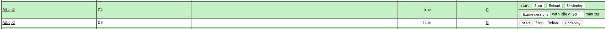

This is webapp to test Tomcat parallel deploy.
=

Typically, web applications work with the database.

When using dbcp2, tomcat parallel deploy is fail.
It is Tomcat's bug.

parallel deploy process is simply below.

### given
1. Tomcat is 7.0 or above
2. autoDeploy is true
3. undeployOldVersions is true
4. webapp##01.war is deployed.

### when
5. webapp##02.war copy into webapps

### then
6. webapp##02 is deploy.
7. webapp##01 is undeployed.
8. webapp##01.war is deleted.

Error is occur between 6 and 7.

JMX name of class instant must different between webapp##01 and webapp##02.
Otherwise, Tomcat says that the JMX name is duplicated and throws an error.
In my test, Tomcat says [like this](./catalina.out.log).

So, manager UI shows to us like below after parallel deploy,

